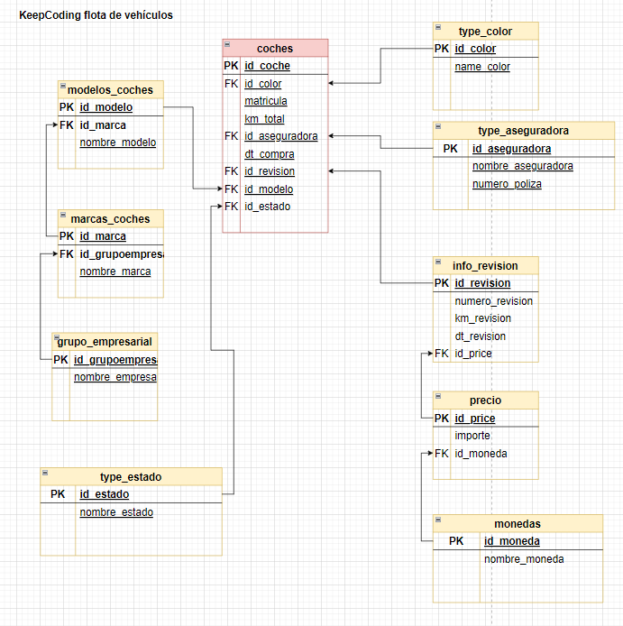

# sqlGeneracion de base de datos de una flota de vehículos

## Archivo DDL

Esta base de datos controla los modelos de los coches, las marcas y el grupo empresarial de la marca (por ejemplo VW
SEAT, Audi etc. pertenecen al grupo VAN.
De los coches también necesitamos saber el color del coche, su matrícula, el número total
de kilómetros que tiene, la compañía aseguradora ( Mapfre, MMT, AXA etc), el número de
póliza, fecha de compra etc.
Además queremos controlar de cada coche Las revisiones que se han pasado al coche
sabiendo los Kms que tenía en el momento de la revisión, la fecha de la revisión y el
importe de la revisión.

## Archivo DML

consulta SQL para sacar el siguiente listado de coches activos
- Nombre modelo, marca y grupo de coches (los nombre de todos)
- Fecha de compra
- Matricula
- Nombre del color del coche
- Total kilómetros
- Nombre empresa que está asegurado el coche
- Número de póliza